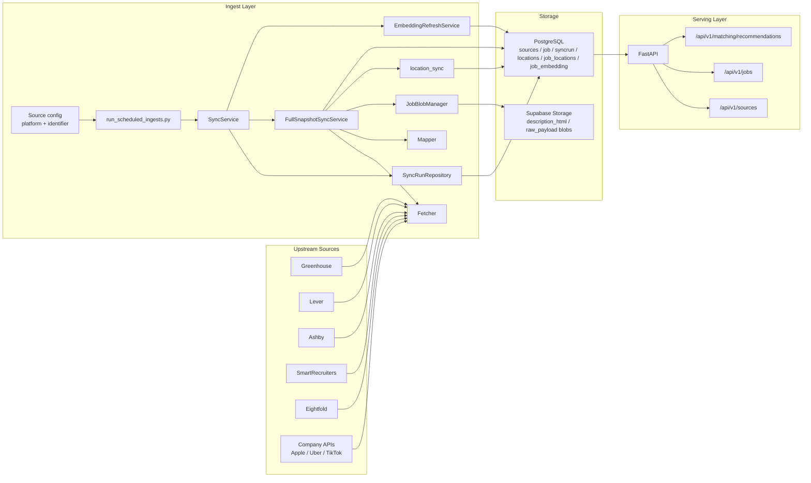
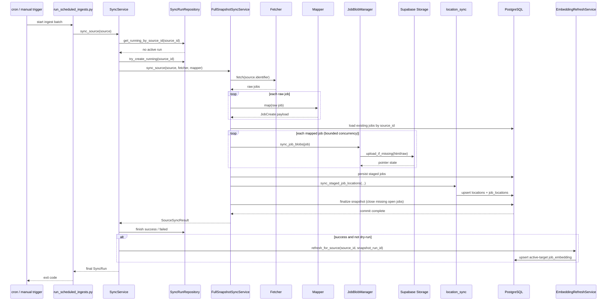
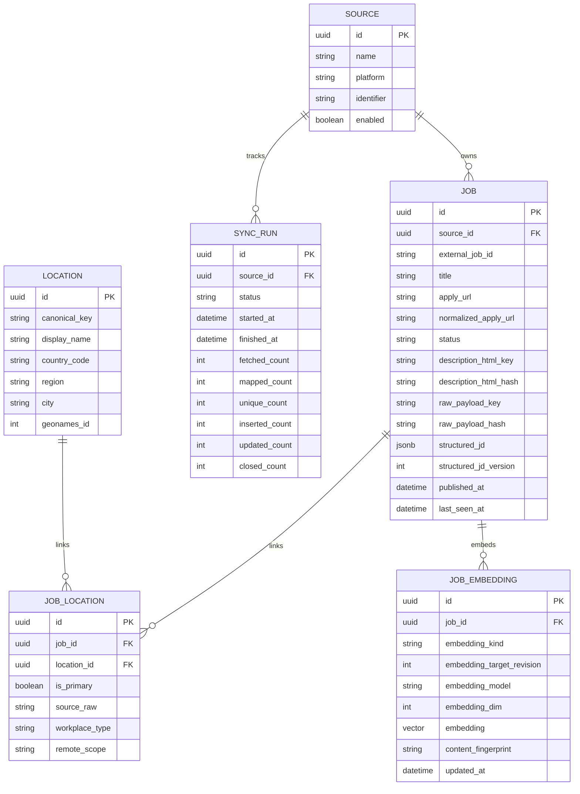
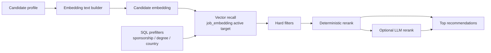

# Architecture Diagrams

These diagrams describe the current implemented architecture only.
No planned/target-state model is included in this document.

Related design notes:

- [Content Fingerprint Design](./content-fingerprint.md)
- [Skills Alignment Component (Draft)](./skills-alignment-component.md)
- [Skills Alignment Production Plan](./skills-alignment-production-plan.md)

## 1. System Overview

## 2. Ingest Sequence

Implementation notes:

- `FullSnapshotSyncService` is split into `app/services/application/full_snapshot_sync/` modules (`mapping`, `staging`, `location_sync`, `finalize`, `service`).
- Blob sync uses bounded concurrency during staging (default concurrency is 8).
- Overlap protection is keyed by `source_id` and backed by a DB partial unique index for running `SyncRun`.

## 3. Current Database Model

- `source_id` is the authoritative owner FK on both `job` and `syncrun`.
- Canonical locations are normalized via `locations` + `job_locations`.
- Large content is pointer-based (`description_html_key`, `raw_payload_key`), with payloads stored in Supabase Storage.
- Legacy physical columns `job.source`, `syncrun.source`, `job.location_text`, `job.description_html`, and `job.raw_payload` are already dropped.

## 4. Current Matching / Retrieval

Current online matching flow:

- Build one candidate embedding text from profile summary + skills + work history.
- Apply SQL prefilters (sponsorship, degree, optional preferred country via `job_locations -> locations`).
- Run vector recall on active-target `job_embedding`.
- Apply hard filters, then deterministic rerank.
- Optionally apply LLM rerank on top candidates.

