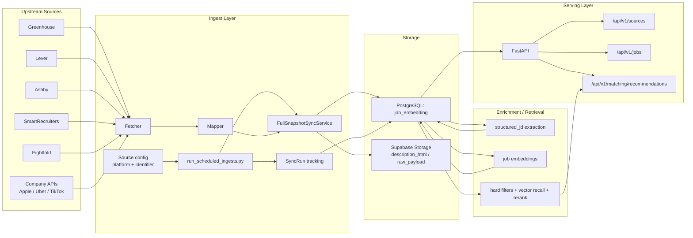
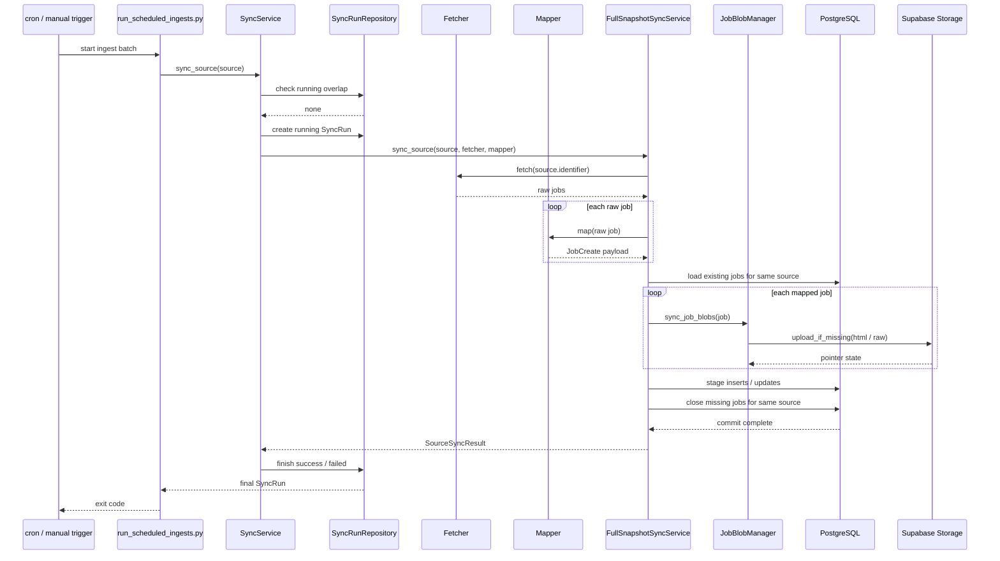
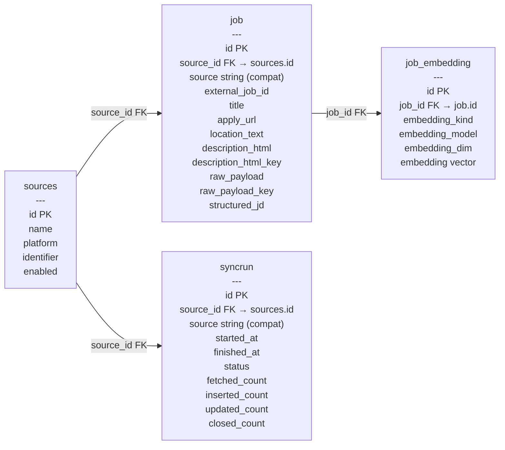
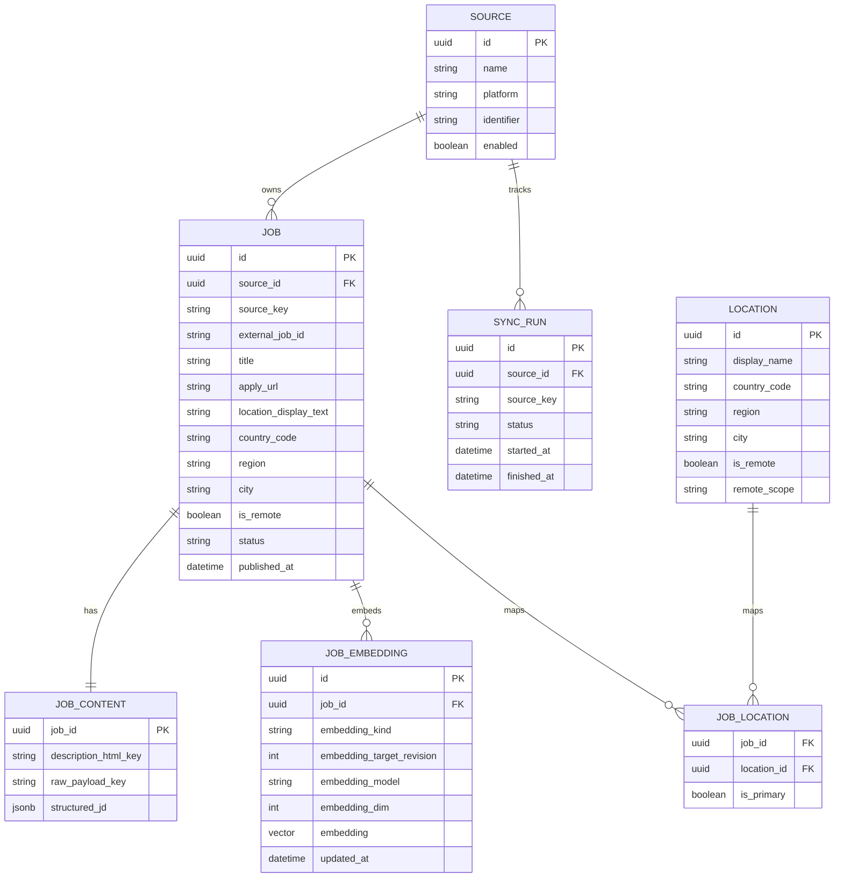
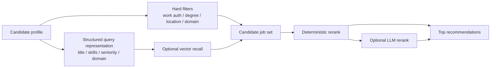

# Architecture Diagrams

These diagrams capture the current MVP architecture and the next schema direction already reflected in the roadmap.

They are intentionally lightweight:

- good enough for product and engineering discussion
- close to the current codebase
- explicit about where the design is still transitional

Detailed migration specs:

- [Source ID Migration](./source-id-migration.md)

## 1. System Overview

## 2. Ingest Sequence

## 3. Current Database Shape

`source_id` is the **authoritative owner FK** on both `job` and `syncrun`.
The legacy `source` string field (`platform:identifier`) is dual-written for backward compatibility
and preserved until a future physical rename.

## 4. Target Database Direction

This is the shape implied by the roadmap, not the current implementation.

> **Note**: Location Modeling V1 explicitly defers canonical `LOCATION` and many-to-many `JOB_LOCATION` tables shown below. In V1, location modeling stops at extracting nullable, job-level structured fields directly on the `job` row (`city`, `region`, `country_code`, `workplace_type`).

## 5. Matching / Retrieval Direction

Current matching works, but the retrieval strategy is still transitional.

The current baseline is close to:

- candidate profile -> one embedding
- job JD -> one embedding
- vector recall -> hard filters -> rerank

The likely target design is:

- structured filters first
- vector recall as an optional recall layer, not the only retrieval primitive
- embeddings stored in dedicated `job_embedding` table with active target resolution

