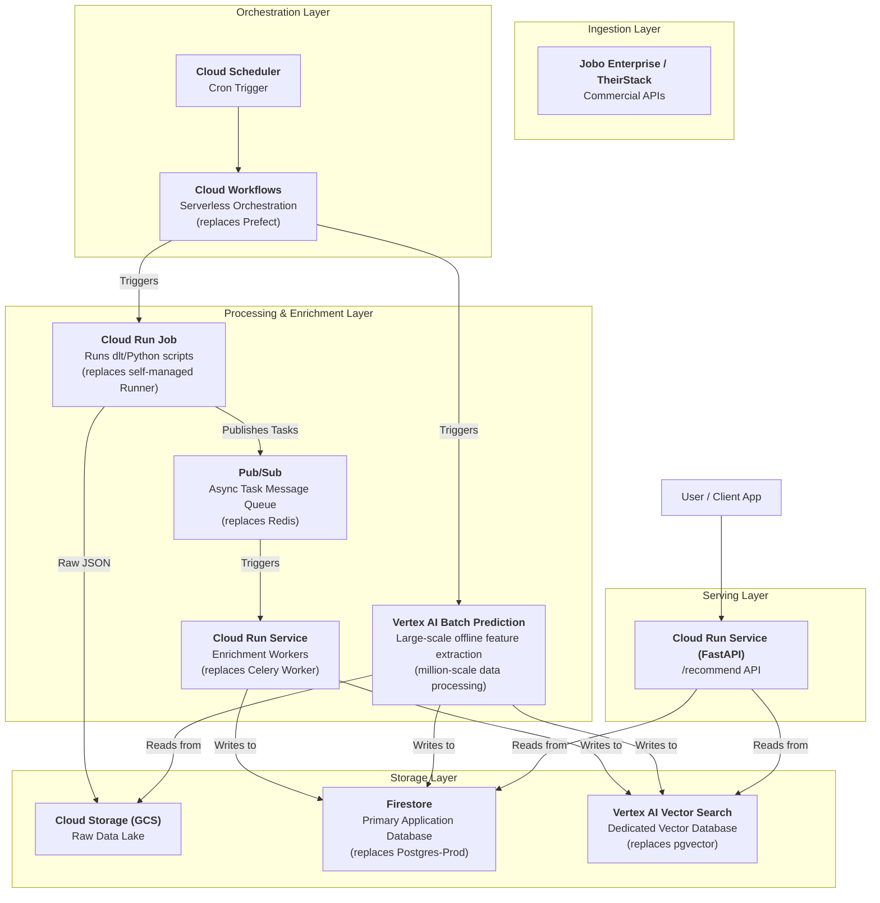

# Job Aggregation & Recommendation Engine: Technical Architecture & Implementation Plan v3.0 (GCP Full-Stack Edition)

**Date:** 2026-02-25
**Author:** Manus AI

## 1. Core Problem & Architecture Goals

The problem raised is critical: it strikes at the core tradeoff between "self-hosted" vs "managed", and "flexibility" vs "maintenance cost". The v2.0 solution, while powerful, introduced multiple open-source components that require self-management (Postgres, Celery, Prefect). To maximize "not reinventing the wheel", the v3.0 plan fully embraces the GCP Serverless ecosystem. The goal is to build a **modern data platform with minimal ops overhead, automatic scaling, and full leverage of Google's AI/Data ecosystem**.

The core idea: replace every "self-hosted" component in the v2.0 architecture with its corresponding GCP managed service.

---

## 2. GCP Full-Stack Architecture vs. Open-Source Hybrid Architecture

We present two architecture options: **Option A (GCP Full-Stack)** and **Option B (Open-Source Hybrid)** for clear comparison.

### Option A: GCP Full-Stack Serverless Architecture Diagram

### Option B: Open-Source Hybrid Architecture (v2.0 recap)

- **Orchestration**: Prefect (self-managed or cloud version)
- **Processing**: Celery + Redis (self-managed)
- **Storage**: PostgreSQL + pgvector (self-managed or Cloud SQL)

### Architecture Comparison & Selection Recommendation

| Module | Option A: GCP Full-Stack (Recommended) | Option B: Open-Source Hybrid | Key Consideration |
| :--- | :--- | :--- | :--- |
| **Database** | **Firestore** + **Vertex AI Vector Search** | PostgreSQL + pgvector | **Cost & Scalability**: Firestore is nearly free at low scale and auto-scales. While PG is more flexible, Cloud SQL instances cost at least ~$10/month in fixed costs and require manual scaling. Vertex AI is purpose-built for large-scale vector search and far outperforms pgvector. |
| **Task Queue** | **Cloud Tasks/PubSub** + **Cloud Run** | Celery + Redis | **Ops Overhead**: The GCP option is fully Serverless with **zero ops**. No need to manage Celery worker deployments, monitoring, or scaling; no need to maintain Redis instances. This is the core embodiment of "not reinventing the wheel". |
| **Orchestration** | **Cloud Scheduler** + **Cloud Workflows** | Prefect | **Ecosystem Integration**: Cloud Workflows integrates seamlessly with other GCP services (IAM, Billing, Logging). While Prefect is more powerful, Workflows is sufficient for current needs and much lighter weight. |
| **Million-Scale Processing** | **Vertex AI Batch Prediction** / **Dataflow** | Self-scaling Celery Workers | **Turnkey Solution**: This is exactly the answer to the scaling question. GCP provides managed services designed for large-scale data processing. You only write business logic (e.g., feature extraction functions); GCP automatically handles parallel compute, resource scheduling, and error retries — no need to manually manage hundreds of thousands of Celery processes. |

**Final Recommendation: Adopt Option A (GCP Full-Stack).** This option has decisive advantages in initial cost, long-term ops, and scalability — perfectly aligned with the goals of "not reinventing the wheel" and embracing the cloud ecosystem.

---

## 3. Module Deep Dive (GCP Full-Stack Edition)

### 3.1. Storage Layer: Firestore + Vertex AI Vector Search

- **Why Firestore instead of Postgres?**
    - **Cost advantage**: Firestore's free tier is very generous (e.g., 1 GiB storage, 50K reads per day), making it ideal for early-stage projects. Before reaching millions of documents, your database cost could be nearly zero. Cloud SQL for PostgreSQL, even at the smallest instance, has fixed monthly instance running costs.
    - **Serverless & Auto-scaling**: No need to worry about database capacity planning or scaling — Firestore automatically handles load based on your read/write volume.
- **Why Vertex AI Vector Search instead of pgvector?**
    - **Professional-grade performance**: Vertex AI Vector Search is a dedicated, managed vector database using the same underlying technology as Google Search and YouTube recommendations. It far exceeds pgvector (which is a general-purpose database extension) in index build speed, query latency, and scalability.
    - **Decoupling**: Separating structured data (Firestore) from vector data (Vertex AI) allows both to be independently scaled and optimized.

### 3.2. Task & Processing Layer: Cloud Tasks/PubSub + Cloud Run

- **Goodbye Celery**: This combination is the perfect Serverless replacement for Celery.
    - **Flow**: The data ingestion service (a Cloud Run Job), after fetching new job data, doesn't process it directly. Instead, it publishes the job ID or basic info as a message to a **Pub/Sub** topic.
    - **Trigger**: One or more independent **Cloud Run Services** subscribe to that topic. Whenever a new message arrives, GCP automatically starts a service instance to process it (i.e., execute the enrichment task).
    - **Advantage**: You only write the Python function to process individual tasks. GCP automatically handles message queuing, service triggering, and instance cold-start/teardown. When there are 1 million tasks, GCP automatically scales to hundreds or thousands of parallel Cloud Run instances; after processing, it automatically scales down to zero — you only pay for actual milliseconds of execution.

### 3.3. The "Turnkey Solution" for Million-Scale Data Processing

This point was emphasized multiple times. GCP provides two tiers of solutions:

1. **Lightweight (recommended for initial use)**: The **Pub/Sub + Cloud Run** pattern described above. For processing millions of independent, per-task enrichments (like skill extraction, embedding generation), this is already highly efficient.

2. **Heavy-duty (for complex aggregation and transformation)**: **Cloud Dataflow**. This is a fully managed service for running **Apache Beam** pipelines. When you need to perform complex cross-record aggregations on millions of records (e.g., calculating the average salary for a specific skill across all positions), Dataflow is the best choice. It automatically distributes your Python code across large-scale compute clusters for parallel execution.

**Conclusion**: For your enrichment tasks, **Pub/Sub + Cloud Run** is the most direct, lightweight "turnkey solution".

---

## 4. Revised Implementation Roadmap (GCP Full-Stack Edition)

| Phase | Timeline | Core Deliverables | Key Technology / Goals |
| :--- | :--- | :--- | :--- |
| **P0: Core Pipeline MVP** | Week 1-2 | - Single-source end-to-end data flow - Basic API endpoints | - Use **Cloud Scheduler** + **Cloud Run Job** to trigger daily Jobo API ingestion. - Write raw data to **GCS**, structured data to **Firestore**. - Set up **Cloud Run (FastAPI)** service with a simple `/jobs` endpoint. |
| **P0.5: Async Enrichment** | Week 3-4 | - Async feature extraction pipeline | - Modify the ingestion service to: after fetching data, publish tasks to **Pub/Sub**. - Create a new **Cloud Run Service** subscribing to Pub/Sub, executing Nesta skill extraction, and writing results back to Firestore. |
| **P1: Vector Search Integration** | Week 5-7 | - Vector-based recommendation API | - Add an embedding generation step in the Enrichment service by calling the Vertex AI API. - Store embeddings in **Vertex AI Vector Search**. - Implement the recommendation API in FastAPI: fetch structured results from Firestore -> query Vertex AI to get Top-N matches. |
| **P2: LLM Rerank & Scale Testing** | Week 8-10 | - More precise Rerank recommendations - Validate large-scale processing capability | - Add an LLM Rerank step to the recommendation API (can use Vertex AI Models or OpenAI). - **Stress test**: Simulate inserting 1M messages into Pub/Sub at once; validate Cloud Run's auto-scaling capability and end-to-end processing time. |

This v3.0 plan provides a clear path to building a truly "cloud-native", low-ops, highly-scalable architecture.
