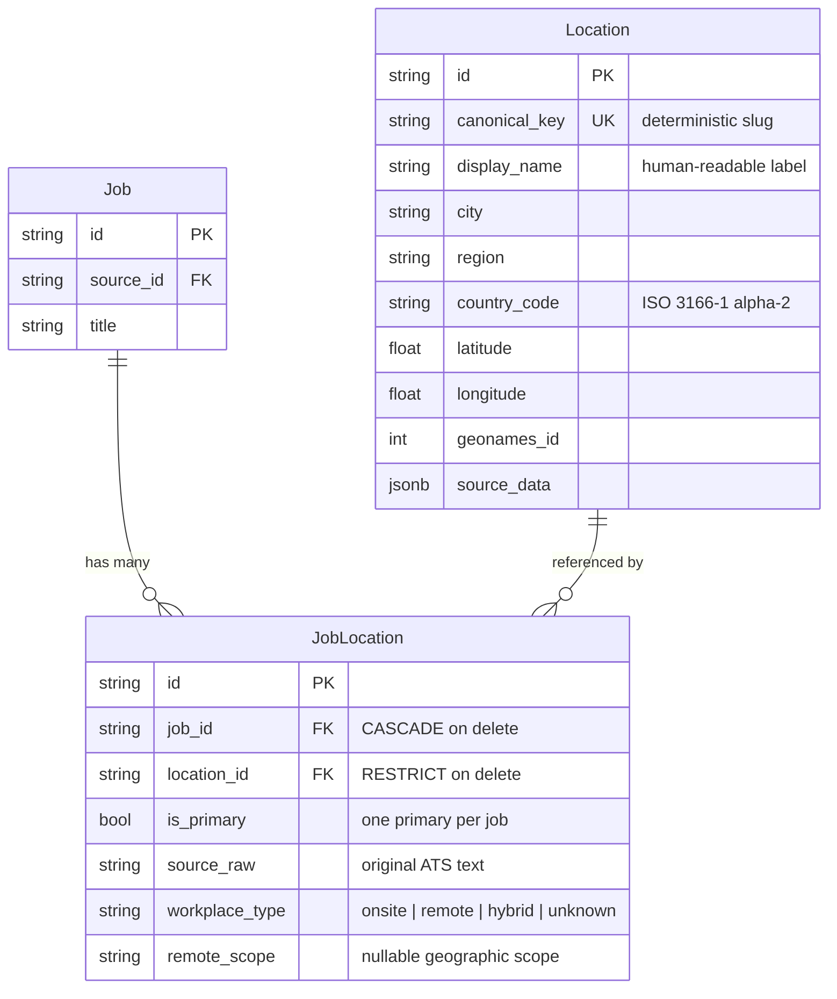

# Data Model: Location

Canonical data model for normalized job locations. Shared across features.

## Entity Relationship

## Location

Canonical, deduplicated geographic location. One row per unique `(country, region, city)` combination. Shared across all jobs — multiple jobs in "San Francisco, CA, US" point to the same `Location` row.

| Field | Type | Constraints | Description |
|-------|------|-------------|-------------|
| `id` | UUID | PK | |
| `canonical_key` | string | Unique index | Deterministic slug built from `{country}-{region}-{city}`, normalized to ASCII lowercase |
| `display_name` | string | NOT NULL | Human-readable label, e.g. "San Francisco, CA, US" |
| `city` | string | nullable | |
| `region` | string | nullable | State/province |
| `country_code` | string(2) | nullable | ISO 3166-1 alpha-2. Null when country cannot be determined conservatively |
| `latitude` | float | nullable | From GeoNames enrichment |
| `longitude` | float | nullable | From GeoNames enrichment |
| `geonames_id` | int | nullable | GeoNames city ID for downstream enrichment |
| `source_data` | JSONB | nullable | Raw resolver metadata |

**Dedup strategy**: upsert on `canonical_key`. Two location strings that normalize to the same slug share one row.

**Canonical key construction** (`canonical_location.py`): Unicode-normalize → strip accents → lowercase → replace hyphens with spaces → remove non-alphanumeric except spaces → join with hyphens. Example: `"São Paulo"` → `"sao-paulo"`, `"San Francisco, CA, US"` → `"us-ca-san-francisco"`.

## JobLocation

Join table linking a job to one or more locations. Carries per-job-per-location metadata (workplace type, remote scope, primary flag).

| Field | Type | Constraints | Description |
|-------|------|-------------|-------------|
| `id` | UUID | PK | |
| `job_id` | string(36) | FK → `job.id`, CASCADE | |
| `location_id` | string(36) | FK → `locations.id`, RESTRICT | Prevents orphaning shared locations |
| `is_primary` | bool | default false | At most one primary per job |
| `source_raw` | string | nullable | Original location text as received from the ATS, preserved for debugging |
| `workplace_type` | string(32) | default "unknown" | `onsite`, `remote`, `hybrid`, or `unknown` |
| `remote_scope` | string | nullable | Geographic scope of remote work, e.g. "US", "EMEA" |

**Constraints**:

- Unique on `(job_id, location_id)` — a job can't link to the same location twice
- Partial unique index on `(job_id) WHERE is_primary = true` — enforces one primary per job (Alembic migration only, not in SQLModel metadata due to SQLite test compatibility)

**Delete semantics**:

- `job_id` CASCADE: deleting a job removes all its location links
- `location_id` RESTRICT: a shared location cannot be deleted while any job references it
